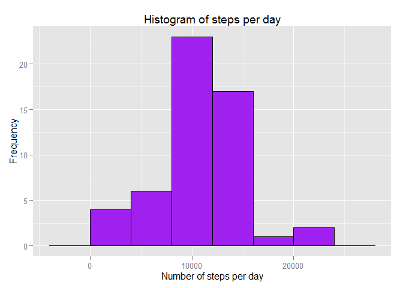
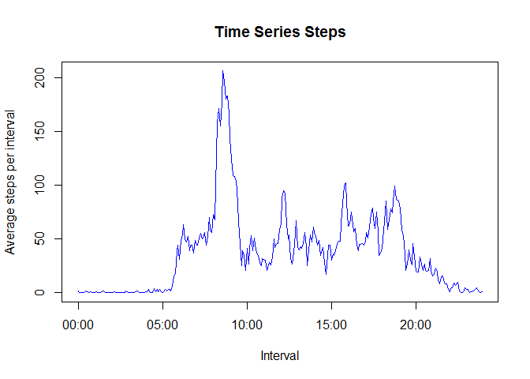
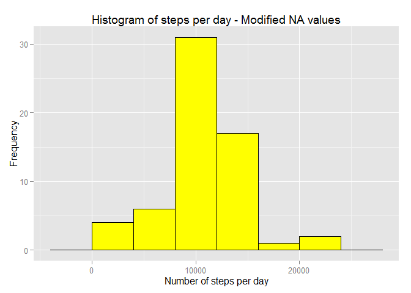
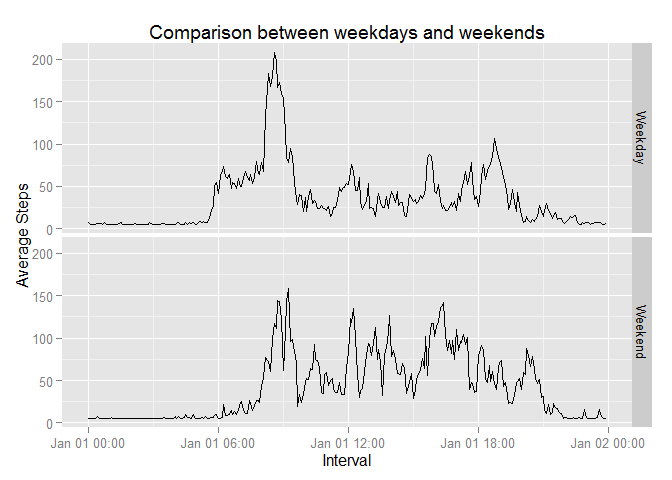

# Reproducible Research: Peer Assessment 1
Arturo Equihua  
The following sections explain the analysis done to the activity dataset. As explained in the [README file](https://github.com/aequihua/RepData_PeerAssessment1/blob/master/README.md), "The data consists of two months of data from an anonymous individual collected during the months of October and November, 2012 and include the number of steps taken in 5 minute intervals each day.". 

## Loading and preprocessing the data
The activity data is located in the *activity.csv* file in the *./activity* folder. In short, the dataset is composed of three columns:

- steps: Number of steps taking in a 5-minute interval (missing values are coded as NA)
- date: The date on which the measurement was taken in YYYY-MM-DD format
- interval: Identifier for the 5-minute interval in which measurement was taken

The data was read into a dataframe and the interval column was transformed from numeric to a Date format so that it could be processed more easily for time series plots. This is the code that does the data load and the transformation:


```r
  library(stringr)
  library(lubridate)

  dataset <- read.csv("./activity/activity.csv",colClasses=c("numeric","Date","numeric"))
  # Transform the interval column to time values
  dataset <- transform(dataset,interval=str_pad(as.character(interval),4,pad="0"))
  dataset <- transform(dataset,interval=sub("([[:digit:]]{2,2})$", ":\\1", interval))
  dataset <- transform(dataset,interval=ymd_hm(paste("2010-01-01",interval)))
```

As shown above, I used the _stringr_ and _lubridate_ packages to make things easier. Still it was kind of challenging to convert the interval, numeric values to time values. For example, an interval value of 0 had to look as "00:00", a value of 330 had to be "03:30" and so on. 

## What is mean total number of steps taken per day?
In the following code I take the dataset of the previous section and produce a histogram plot of the total steps per day. I wanted to use ggplot2 to practice this framework a little bit.


```r
  library(plyr)
  library(ggplot2)

  # Group the total steps per date, the value will be in V1 column
  sumed=ddply(dataset,c("date"),function(dataset)sum(dataset$steps))

  # Plot the histogram
  ggplot(data=sumed, aes(x=sumed$V1)) + 
      geom_bar(stat="bin",binwidth=4000, colour="black", fill="purple")+
      xlab("Number of steps per day")+ylab("Frequency")+
      ggtitle("Histogram of steps per day")
```

 

Now we calculate the mean and median values of the entire dataset, with the code below. We need to remove the NA values so that a result can be obtained:


```r
  av = mean(sumed$V1,na.rm=TRUE)
  md = median(sumed$V1,na.rm=TRUE)
```

The **mean** value is 10766 steps per day and the **median** value is 10765 steps per day.


## What is the average daily activity pattern?
Now we analyze the data in terms of the times of the day (that is, the intervals). We are interested in knowing how, in average, the number of steps is depending on the time of the day. 

In doing so, we need the following steps:

### Produce a summary of the average steps per interval
The following code produces a dataframe with two columns: The time interval and the average number of steps for that time interval. Again, the NA values need to be removed for the calculation:


```r
  library(lubridate)
  library(plyr)
  
  # Summarize the average values of the intervals
  sumed <- ddply(dataset,c("interval"),function(dataset){
       round(mean(dataset$steps,na.rm=TRUE))
    })
  colnames(sumed) = c("interval","avgsteps")
```

Once we have the dataframe, we can plot the time series as shown below:


```r
  # Produce the time series plot
  plot(sumed,type="l",xlab="Interval",ylab="Average steps per interval",main="Time Series Steps",col="blue")
```

 

The time series suggests the highest number of steps occurs during the morning. To determine exactly in what time interval we have the highest number of steps (in average), this is the code:


```r
  # Return which interval has the highest number of average steps, formatted as HH:MM, and include
  # the number of steps in that interval
  n=which(sumed$avgsteps==max(sumed$avgsteps,na.rm=TRUE))
  a=sumed[n,]$interval
  val=paste(str_pad(hour(a),2,pad="0"),":",str_pad(minute(a),2,pad="0"),sep="")
  stp=round(sumed[n,]$avgsteps)
```

From the code above, we conclude that the time interval with the highest value is at **08:35**, with **206 steps**. 

## Imputing missing values
The previous sections dealt with missing values (NA) in the dataset by removing them. In this section we implement a transformation of the data by substituting the NAs with the average day values, so that we try go get more meaningful results in our analysis. 

As an starting point, we calculate the number of rows that contain missing values. This is done by the following code:


```r
    nr =  nrow(dataset[which(is.na(dataset)),])
```

From which we obtain that there are **2304** rows containing NA values.

To replace the NA values with the daily averages, we calculate the averages first and put those into a dataframe:


```r
 # Fill the NA values, for this exercise I will take the mean of the day to
  # replace the NA values
  meanDF=ddply(dataset,c("date"),function(dataset)mean(dataset$steps,na.rm=TRUE))
  
  # Replace the NaN average values with the entire period average
  meanDF=transform(meanDF,V1=ifelse(is.nan(V1),mean(meanDF$V1,na.rm=TRUE),V1))
```

This way we can modify our original dataset by using the _apply_ function as per the below:


```r
 # Replace the NA values of the main dataset using the apply function
  newdata = dataset
  colnum=apply(newdata,1,function(x) { 
                            if (is.na(x[1])) 
                                  meanDF[meanDF$date==x[2],]$V1 
                            else 
                                  x[1] } )
  newdata$steps = as.numeric(colnum)
```

Now that we have a modified dataset, we produce the same histogram as per the previous section:


```r
  library(plyr)
  library(ggplot2)

  # Group the total steps per date, the value will be in V1 column
  sumed=ddply(newdata,c("date"),function(x)sum(x$steps))

  # Plot the histogram
  ggplot(data=sumed, aes(x=sumed$V1)) + 
      geom_bar(stat="bin",binwidth=4000, colour="black", fill="yellow")+
      xlab("Number of steps per day")+ylab("Frequency")+
      ggtitle("Histogram of steps per day - Modified NA values")
```

 

No significant differences are noticed between the original histogram and the new version.

The mean and median values are recalculated:


```r
  av2 = mean(sumed$V1,na.rm=TRUE)
  md2 = median(sumed$V1,na.rm=TRUE)
```

Comparison of mean and median values:

  - Mean with original dataset:10766
  - Mean with modified dataset:10766

  - Median with original dataset:10765
  - Median with modified dataset:10766

The above suggests that, when the NA data is populated with average values, the mean and the median tend to become the same.

## Are there differences in activity patterns between weekdays and weekends?
Finally, we work on the _new_ dataset by adding a factor column to split the weekdays (Monday to Friday) and the weekend days (Saturday and Sunday), in order to produce a separate time series chart and compare the behavior. 

The code below does the data transformation and produces the chart with ggplot2, as can be seen the lubridate package is also used to better manipulate the date column:


```r
  library(lubridate)
  library(ggplot2)
  
# Create the factor column for Weekday-Weekend
  newdata$daytype = ifelse((wday(newdata$date) %in% c(1,7)),"Weekend","Weekday")
  newdata$daytype = as.factor(newdata$daytype)

# Get the averages by interval value
  sumed <- ddply(newdata,c("daytype","interval"),function(x){
                          round(mean(x$steps,na.rm=TRUE))
                      })
  colnames(sumed) = c("DayType","Interval","AvgSteps")

# Obtain the plots using ggplot2
  qplot(Interval,AvgSteps,data=sumed,facets=DayType~.,
        geom="line",ylab="Average Steps") +
        ggtitle("Comparison between weekdays and weekends")
```

 


From the time series above, it seems that in general the weekdays have more walking activity than the weekends, especially early in the morning (between 06:00 and 12:00).


